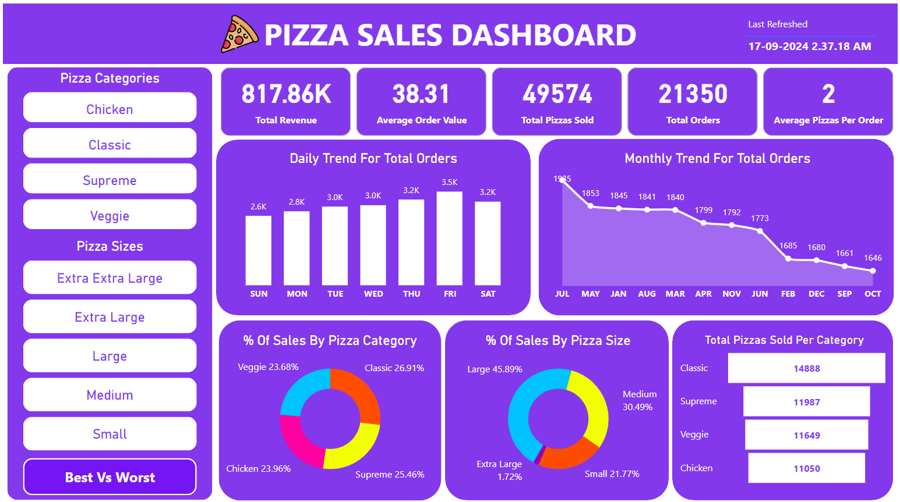

# 🍕 Pizza Sales Dashboard

This repository contains a detailed and interactive **Pizza Sales Dashboard** that provides insights into the performance of various pizza categories, sizes, and overall sales trends. The dashboard is built using **Power BI** and helps stakeholders visualize important business metrics and trends for making data-driven decisions.

## 💻 Technologies Used

- **Tool:** Power BI (or any visualization tool you used)
- **Languages:** SQL (for data extraction/processing)
- **Data Source:** Dataset (https://drive.google.com/file/d/1vnUQKAX1cEcYF05QQ-hm8wv0zMCrsjIb/view?usp=sharing)

## 📊 Dashboard Overview

This project visualizes pizza sales data using an interactive dashboard.

The Pizza Sales Dashboard showcases the following key insights:

1. **Total Revenue:** 817.86K  
2. **Average Order Value (AOV):** 38.31  
3. **Total Pizzas Sold:** 49,574  
4. **Total Orders:** 21,350  
5. **Average Pizzas Per Order:** 2  

The dashboard highlights both daily and monthly trends, pizza sales performance by category and size, and identifies top and bottom-performing pizzas.

## 🔍 Key Metrics and Insights

- **Sales by Pizza Category:**
  - Classic (26.91%)
  - Supreme (25.46%)
  - Chicken (23.96%)
  - Veggie (23.68%)

- **Sales by Pizza Size:**
  - Large (45.89%)
  - Medium (30.49%)
  - Small (21.77%)
  - Extra Large (1.72%)

- **Daily Sales Trends:** Highest sales on Fridays with 3.5K orders.  
- **Monthly Sales Trends:** A decline in orders from 1,935 in July to 1,646 in October.  

## 📈 Top-Performing Pizzas

- **Top 5 Pizzas by Revenue:**
  1. The Thai Chicken Pizza – 43K
  2. The Barbecue Chicken Pizza – 43K
  3. The California Chicken Pizza – 41K
  4. The Classic Deluxe Pizza – 38K
  5. The Spicy Italian Pizza – 35K

- **Top 5 Pizzas by Quantity Sold:**
  1. The Classic Deluxe Pizza – 2.5K
  2. The Barbecue Chicken Pizza – 2.4K
  3. The Thai Chicken Pizza – 2.4K
  4. The California Chicken Pizza – 2.4K
  5. The Spicy Italian Pizza – 1.9K

## ⚠️ Bottom-Performing Pizzas

- **Bottom 5 Pizzas by Revenue:**
  1. The Brie Carre Pizza – 12K
  2. The Spinach Pesto Pizza – 16K

- **Bottom 5 Pizzas by Quantity Sold:**
  1. The Brie Carre Pizza – 480 units
  2. The Green Garden Pizza – 490 units

## 📝 Recommendations

1. **Increase Sales During Weekdays:** Launch promotions for Thursdays and Fridays to capitalize on peak sales days.
2. **Revive Underperforming Items:** Consider modifying or promoting underperforming pizzas like the "Brie Carre Pizza" or removing them from the menu.
3. **Boost Large Pizza Sales:** Since large pizzas contribute the highest sales, offer family bundles or upsell large pizzas in customer orders.
4. **Combat Declining Monthly Trends:** Address the drop in sales from July to October by launching seasonal offers, targeted marketing, or loyalty programs.
5. **New Pizza Variants:** Use the success of top-performing pizzas to inspire new pizza varieties.

Bibhash Dash.

